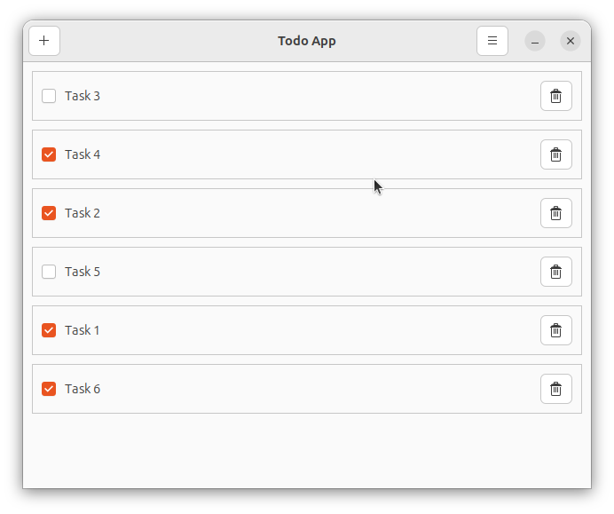
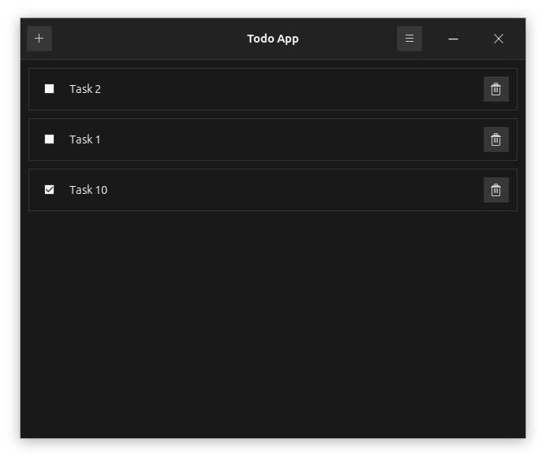
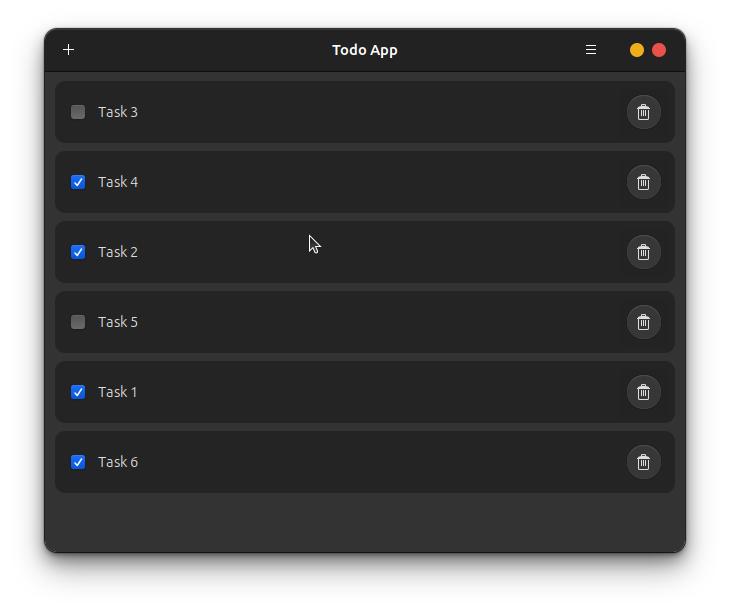

# RBF/RS stack app example

_Yeah, I know that 3 different frontends for 3 different platforms in 3 different languages is crazy ;P_

It is a _simple_ cross-platform ToDo-application example, using rbf/rs stack:

* **Relm (Rust)** for desktop
* **Blazor (C#)** for web
* **Flutter (Dart)** for mobile
* **Rocket + SurrealDB (Rust)** for backend

## Installation instructions

### Run backend

* Run SurrealDB database
    ```bash
    $ surreal start memory -A --user root --pass root --bind 0.0.0.0:8001
    ```

* Run API
    ```bash
    $ cd todo_api
    $ cargo run -- -A 127.0.0.1:8001 -U root -P root
    ```


### Run on desktop

```bash
$ cd todo_desktop
$ cargo run -- -A 127.0.0.1:8000/api -M http
```

### Run on Android

```bash
WIP
```

### Run on web

```bash
WIP
```

## Screenshots

### Ubuntu


### Windows


### macOS
